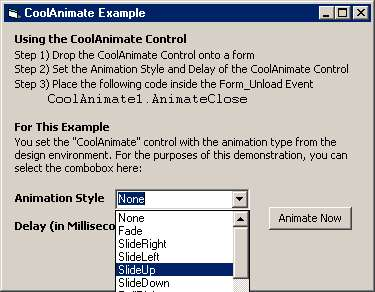



## Windows Roll/Slide Control

### Description

I have been tinkering with the Windows API AnimateWindow function, and have wrapped it into a user control, which you can drop onto any top-level window. You simply call the controls CloseAnimation method from the form_unload event, and your window will roll or slide up, down, left, or right, or fade or zoom to nothing. This easy to use control has 2 main properties - the "AnimationEffect", and the "EffectDelay". The included example project here shows how easy it is to use. It seems that this API Function exists in Windows 98, ME, 2000, and XP (I was unable to get this to work with Windows 95 or Windows NT). I got varying levels of effectiveness depending on the OS. Keeping the EffectDelay to a minimum (500 or less) usually produces great results. This project has the default delay at 1000 to exagerate the effect, but you should set to 400 or 500 in your projects. Use the "Project1.vbp" to see the example, or include the CoolAnimate.ctl in your project to just use the user control. Hope this is helpful to some of you.
 
### More Info
 

             |
---                |---
**Submitted On**   |2002-09-03 13:58:22
**By**             |[Anthony Dunleavy](https://github.com/Planet-Source-Code/PSCIndex/blob/master/ByAuthor/anthony-dunleavy.md)
**Level**          |Advanced
**User Rating**    |5.0 (10 globes from 2 users)
**Compatibility**  |VB 4\.0 \(32\-bit\), VB 5\.0, VB 6\.0
**Category**       |[Custom Controls/ Forms/  Menus](https://github.com/Planet-Source-Code/PSCIndex/blob/master/ByCategory/custom-controls-forms-menus__1-4.md)
**World**          |[Visual Basic](https://github.com/Planet-Source-Code/PSCIndex/blob/master/ByWorld/visual-basic.md)
**Archive File**   |[Windows\_Ro126110932002\.zip](https://github.com/Planet-Source-Code/anthony-dunleavy-windows-roll-slide-control__1-38631/archive/master.zip)

